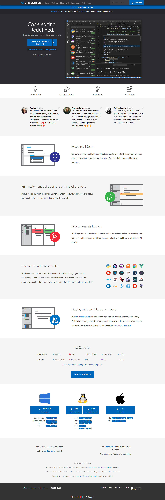

# vs-code-clone

This is one of the Taliwind CSS assignments, was given in **Full Stack JavaScript Bootcamp 2.0** mentored by [Hitesh Choudhary](https://github.com/hiteshchoudhary) and [Anurag Tiwari](https://github.com/anuragtiwarime).

Made a **Fully Responsive** clone of VS Code using **Tailwind CSS**.

I learned so many things while building this project. Like,

- Use of HTML semantic tags
- Where to use Flexbox and where to use Grid
- CSS Positions
- z-index
- Responsive Design using Tailwind CSS

### Tech Stack

### :rocket: [Live Link](https://vscode-clone-dipayan.netlify.app)

### Overview

**[Desktop View]**

